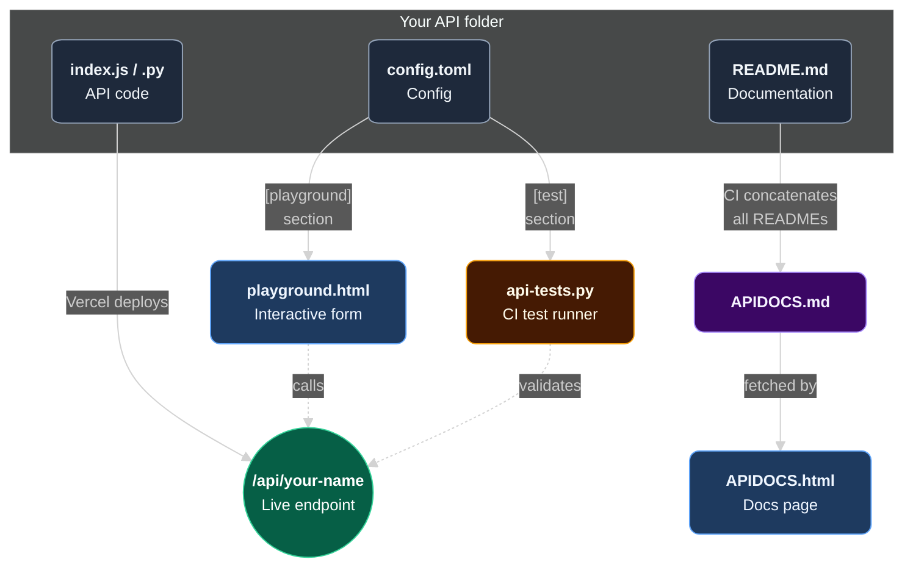
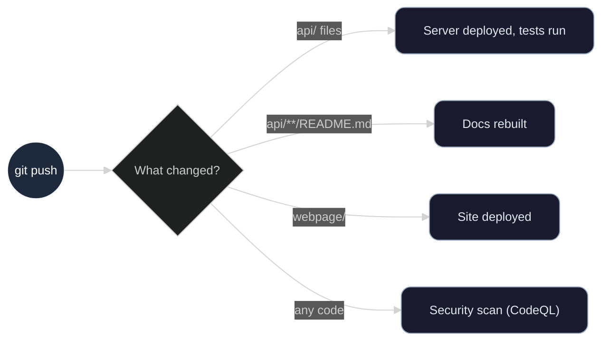
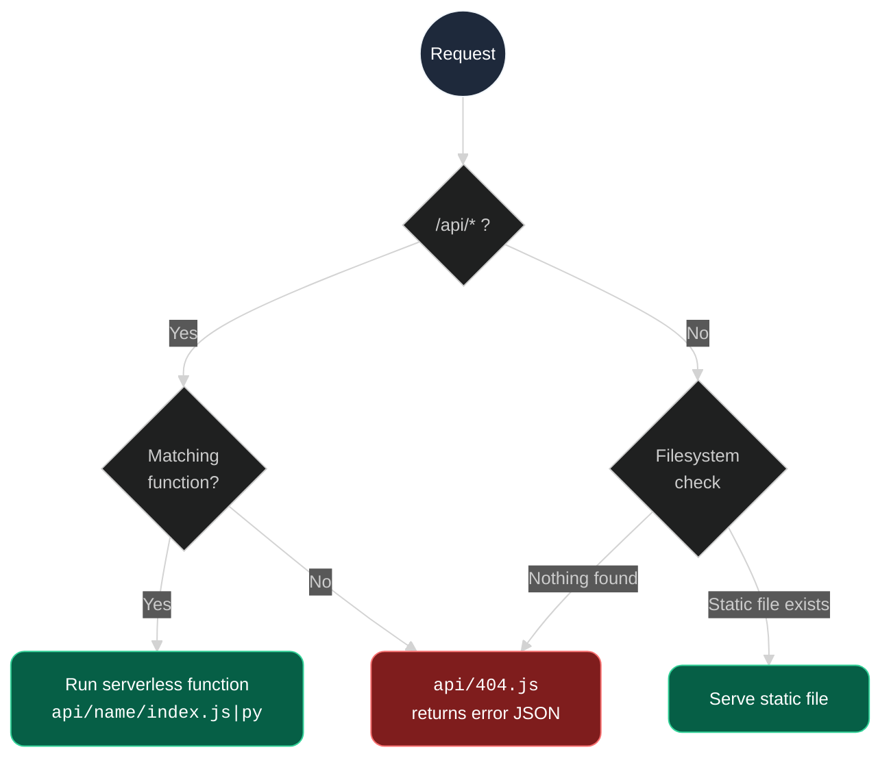

# MIKLIUM Project Structure

Architecture, conventions, and templates for the MIKLIUM open-source API platform.

## Navigation

- [Overview](#overview)
- [Project Layout](#project-layout)
- [How Everything Connects](#how-everything-connects)
- [Frontend Architecture & Rules](#frontend-architecture--rules)
  - [Design System & CSS Variables](#design-system--css-variables)
  - [Navigation & Mobile Support](#navigation--mobile-support)
  - [Additional Information](#additional-information)
- [API Folder Anatomy](#api-folder-anatomy)
  - [Required Files](#required-files)
  - [Optional Files](#optional-files)
  - [Response Contract](#response-contract)
- [File Templates](#file-templates)
  - [Frontend HTML Page Template](#frontend-html-page-template)
  - [Node.js API `index.js`](#nodejs-api-indexjs)
  - [Python API `index.py`](#python-api-indexpy)
  - [Config `config.toml`](#config-configtoml)
    - [Config `config.toml` Detailed Reference](#config-configtoml-detailed-reference)
  - [`README.md` Template](#readmemd-template)
- [Routing](#routing)
- [CI/CD & Automation](#cicd--automation)
  - [Workflows](#workflows)
  - [Auto-Generated Files](#auto-generated-files)
- [Conventions & Rules](#conventions--rules)
  - [Naming](#naming)
  - [Rules for Frontend Development](#rules-for-frontend-development)
  - [Rules for APIs Development](#rules-for-apis-development)

---

## Overview

MIKLIUM is a platform of free, keyless serverless APIs. The codebase splits into four parts:

| Directory | Purpose | Deploys to |
|-----------|---------|------------|
| `.github/` | Workflows, test scripts, issue templates | GitHub Actions |
| `api/` | Serverless API endpoints | Vercel |
| `beta/` | Experimental APIs | — |
| `models/` | Standalone AI/ML models | — |
| `docs` | Documentation for MIKLIUM users and developers | - |
| `webpage/` | Public website: docs viewer, playground, showcase, etc. | GitHub Pages |
| Root files | README, LICENSE, etc. | — |

---

## Project Layout

```
MIKLIUM/
├── .github/
│   ├── workflows/ ← CI/CD workflow definitions
│   ├── scripts/ ← scripts for CI/CD workflows
│   └── ISSUE_TEMPLATE/ ← issue forms
│
├── api/ ← our APIs (Vercel)
│   ├── your-api-name/ ← one folder per API
│   │   ├── index.js or .py ← entry point
│   │   ├── README.md ← documentation
│   │   ├── config.toml ← configuration  for playground and tests
│   │   └── ... ← any other files you need
│   └── 404.js ← fallback for unknown routes
│
├── beta/api/ ← experimental APIs and tools
│
├── models/ ← Standalone AI/ML models
│   └── model-name/ ← one folder per model
│
├── docs/
│   ├── APIDOCS.md ← documentation for all APIs
│   ├── FEATURED_PROJECTS.md ← community projects
│   ├── STRUCTURE.md ← project architecture (this file)
│   ├── SECURITY.md ← security policy
│   ├── CONTRIBUTING.md ← how to contribute
│   ├── CODE_OF_CONDUCT.md ← community standards
│   ├── TODO.md ← roadmap
│   └── DESIGN_GUIDELINES.html ← visual style guide
│
├── webpage/ ← static site (GitHub Pages)
│
├── README.md ← main repository description
├── LICENSE.md ← MIT
└── vercel.json ← routing & CORS
```

---

## How Everything Connects

Three files per API drive the entire system: the live endpoint, the documentation website, and the CI pipeline - without any extra setup:



When you push to `main`, GitHub Actions detects what changed and responds:



---

## Frontend Architecture & Rules

The MIKLIUM frontend is a purely static website built with vanilla HTML, CSS, and JS. Consistency across all pages is maintained by strictly adhering to the following rules.

### Design System & CSS Variables

Do **not** use hardcoded HEX colors or inline font families in HTML. Everything must inherit from the global [`webpage/css/style.css`](https://github.com/MIKLIUM-Team/MIKLIUM/blob/main/webpage/css/style.css) file. 

* **Colors**: 
  * Backgrounds: `var(--bg)` (Root background), `var(--surface)` (Glassmorphism containers).
  * Accents: `var(--accent)` (MIKLIUM Blue), `var(--accent-hover)`.
  * Text: `var(--text-primary)` (White), `var(--text-secondary)` (Muted gray).
* **Typography**:
  * **System Font**: Used by default for all UI elements, headings, and paragraphs.
  * **Monospace Font**: Use `var(--font-mono)` (JetBrains Mono) for code snippets, JSON outputs, API paths, and badges. Automatically applied to `<pre>` and `<code>`.
* **Glassmorphism**: Use the `.glass-card` class for main content blocks to automatically apply the standardized blur, borders, and shadows.

### Navigation & Mobile Support

Every `.html` page across the repository must be fully responsive and include standard navigation:

1. **Global Navbar**: Every page must include the exact `<nav>` block containing both the `.nav-top` (desktop) and `.nav-mobile-links` (mobile) containers.
2. **Mobile Toggle Script**: At the bottom of every `<body>`, you must include the small vanilla JavaScript snippet that handles the hamburger menu (`.nav-toggle`) open/close logic.
3. **Active Page Highlight**: The `<html>` tag must include `data-page="page-id"` so the JS script can automatically highlight the correct link in the navbar.
4. **Layout**: Always wrap main content in semantic tags like `<main>` and use standard spacing variables (e.g., `calc(var(--nav-height) + 48px)` for top padding) to avoid navbar overlap.

### Additional Information

For more information and ready-made elements for our websites, you can visit the [Design Guidelines site](https://miklium-team.github.io/MIKLIUM/docs/DESIGN_GUIDELINES.html) and review [its code](https://github.com/MIKLIUM-Team/MIKLIUM/blob/main/docs/DESIGN_GUIDELINES.html) or see practical usage on other pages of [our website](https://miklium-team.github.io/MIKLIUM/webpage/index.html).

---

## API Folder Anatomy

### Required Files

Every API must have three files:

| File | Purpose | Read by |
|------|---------|---------|
| `index.js` / `index.py` / any Vercel-supported runtime | Serverless function entry point | Vercel |
| `README.md` | API documentation | CI + users |
| `config.toml` | Playground UI + test case definitions | Website + CI |

### Optional Files

Add anything your API needs - Vercel deploys the entire folder:

| File | When |
|------|------|
| `package.json` | Node.js with npm dependencies |
| `requirements.txt` | Python with pip dependencies |
| Subdirectories, helper modules, data files | Whenever your logic needs them |

### Response Contract

Every API must return JSON with a `success` boolean:

```javascript
// Success
{ "success": true, "yourData": "..." }

// Error
{ "success": false, "error": "What went wrong" }
```

> [!IMPORTANT]
> Every response must include CORS headers (`Access-Control-Allow-Origin: *`), and every handler must respond to `OPTIONS` preflight requests. All templates below include this.

## File Templates

### Frontend HTML Page Template

```html
<!DOCTYPE html>
<html lang="en" data-page="your-page-id">
<head>
<meta charset="UTF-8">
  <meta name="viewport" content="width=device-width, initial-scale=1.0">
  
  <!-- Your Page Title and Description: -->
  <title>Your Page - MIKLIUM</title>
  <meta name="description" content="Description of your page.">
  <meta property="og:title" content="Your Page - MIKLIUM">
  <meta property="og:description" content="Description of your page.">
  
  <!-- REQUIRED: Site Configuration -->
  <meta property="og:image" content="https://raw.githubusercontent.com/MIKLIUM-Team/MIKLIUM/refs/heads/main/webpage/assets/Logo_Preview.png">
  <meta property="og:type" content="website">
  <meta name="theme-color" content="#0155A1">
  <link rel="icon" type="image/png" href="https://raw.githubusercontent.com/MIKLIUM-Team/MIKLIUM/refs/heads/main/webpage/assets/Logo_Original.png">
  <link rel="apple-touch-icon" href="https://raw.githubusercontent.com/MIKLIUM-Team/MIKLIUM/refs/heads/main/webpage/assets/Logo_Original.png">
    
  <!-- External Dependencies if needed: -->
  <!-- <link rel="stylesheet" href="https://cdnjs.cloudflare.com/ajax/libs/font-awesome/6.4.2/css/all.min.css" crossorigin="anonymous" referrerpolicy="no-referrer"> -->
    
  <!-- Core MIKLIUM Design System -->
  <link rel="stylesheet" href="css/style.css">
  
  <style>
    main {
      flex: 1;
      padding: 2rem;
      max-width: 960px;
      margin: 0 auto;
      width: 100%;
      padding-top: calc(var(--nav-height) + 48px);
    }
  </style>
</head>
<body>
  
  <!-- REQUIRED: Global Navigation -->
  <nav>
    <div class="nav-top">
      <a href="index.html" class="nav-brand">
        
        MIKLIUM
      </a>
      <button class="nav-toggle" aria-label="Menu"><i class="fas fa-bars"></i></button>
      <ul class="nav-links">
        <li><a href="index.html" data-nav="home">Home</a></li>
        <li><a href="projects.html" data-nav="projects">Projects</a></li>
        <li><a href="APIDOCS.html" data-nav="apidocs">API Docs</a></li>
        <li><a href="playground.html" data-nav="playground">Playground</a></li>
        <li><a href="support.html" data-nav="support">Support</a></li>
      </ul>
    </div>
    <div class="nav-mobile-links">
      <a href="index.html" data-nav="home"><i class="fas fa-house"></i> Home</a>
      <a href="projects.html" data-nav="projects"><i class="fas fa-cube"></i> Featured Projects</a>
      <a href="APIDOCS.html" data-nav="apidocs"><i class="fas fa-book"></i> API Docs</a>
      <a href="playground.html" data-nav="playground"><i class="fas fa-flask"></i> API Playground</a>
      <a href="support.html" data-nav="support"><i class="fas fa-headset"></i> Support</a>
    </div>
  </nav>

  <!-- MAIN CONTENT -->
  <main>
    <div class="page-header">
      <h2>Page Title</h2>
      <p>Page subtitle or description.</p>
    </div>
    
    <!-- Use standard components -->
    <div class="glass-card">
      <p>Your content here...</p>
    </div>
  </main>

  <!-- REQUIRED: Mobile Menu Toggle Script -->
  <script>
    document.addEventListener("DOMContentLoaded", function () {
      var page = document.documentElement.getAttribute("data-page");
      document.querySelectorAll("[data-nav]").forEach(function (a) {
        if (a.getAttribute("data-nav") === page) a.classList.add("active");
      });
      var toggle = document.querySelector(".nav-toggle");
      var mobileLinks = document.querySelector(".nav-mobile-links");
      var navEl = document.querySelector("nav");
      if (!toggle || !mobileLinks || !navEl) return;
      toggle.addEventListener("click", function () {
        var open = mobileLinks.classList.toggle("open");
        navEl.classList.toggle("nav-expanded", open);
        toggle.innerHTML = open ? '<i class="fas fa-xmark"></i>' : '<i class="fas fa-bars"></i>';
      });
    });
  </script>
</body>
</html>
```

### Node.js API `index.js`

```javascript
// This is a Vercel serverless function.
// It handles GET and POST requests and returns JSON.

// Add npm dependencies to package.json if needed:
//   const axios = require('axios');

async function handler(request, response) {
  // CORS (required on every MIKLIUM API)
  // These headers allow browsers to call this API directly.
  // The OPTIONS handler is needed for preflight requests.
  response.setHeader('Access-Control-Allow-Origin', '*');
  response.setHeader('Access-Control-Allow-Methods', 'GET, POST, OPTIONS');
  response.setHeader('Access-Control-Allow-Headers', 'Content-Type');

  if (request.method === 'OPTIONS') {
    return response.status(200).end();
  }

  try {
    // Parse input
    // Support both GET (query params) and POST (JSON body).
    // You can remove the method you don't need.
    // You can also use other methods like PUT, DELETE, etc.

    let query; // Required parameter
    let limit; // Optional parameter with default
    let includeExtra; // Optional boolean flag

    if (request.method === 'GET') {
      const idx = request.url.indexOf('?');
      if (idx !== -1) {
        const params = new URLSearchParams(request.url.substring(idx + 1));
        query = params.get('query');
        limit = parseInt(params.get('limit'), 10) || 5;
        includeExtra = params.get('includeExtra') === 'true';
      }

    } else if (request.method === 'POST') {
      let body = '';
      for await (const chunk of request) body += chunk.toString();

      let parsed;
      try {
        parsed = JSON.parse(body);
      } catch (e) {
        console.log(`JSON parse failed: ${e.message}`);
        return response.status(400).json({
          success: false,
          error: 'Invalid JSON'
        });
      }

      query = parsed.query;
      limit = typeof parsed.limit === 'number' ? parsed.limit : 5;
      includeExtra = parsed.includeExtra === true;

    } else {
      console.log(`Method not allowed: ${request.method}`);
      return response.status(405).json({
        success: false,
        error: 'Method not allowed'
      });
    }

    // Validate required parameters
    if (!query) {
      console.log('Missing query parameter');
      return response.status(400).json({
        success: false,
        error: 'Missing "query" parameter'
      });
    }

    // YOUR LOGIC
    // Replace this with your actual logic.
    // You can call external APIs, process data, etc.

    const result = {
      answer: `Processed: ${query}`,
      limit: limit,
    };

    // Add optional fields conditionally
    if (includeExtra) {
      result.extra = {
        timestamp: new Date().toISOString(),
        version: '1.0.0'
      };
    }

    // Return success
    return response.status(200).json({
      success: true,
      ...result
    });

  } catch (error) {
    // Handle unexpected errors
    console.log(`Error: ${error.name}`);
    console.log(`Message: ${error.message}`);
    console.log(`Stack: ${error.stack?.split('\n')[1]?.trim()}`);
    return response.status(500).json({
      success: false,
      error: 'Internal server error'
    });
  }
}

module.exports = handler;
```

### Python API `index.py`

```python
""" This is a Vercel serverless function.
It handles GET and POST requests and returns JSON. """

# Import your helper modules or dependencies here:
#   from .helpers import something
#   import some_package

import json
from http.server import BaseHTTPRequestHandler
from urllib.parse import urlparse, parse_qs


class handler(BaseHTTPRequestHandler):

    def do_GET(self):
        """Handle GET requests with query parameters."""

        # Parse input
        # Support both GET (query params) and POST (JSON body).
        # You can remove the method you don't need.

        params = parse_qs(urlparse(self.path).query)

        query = params.get('query', [None])[0] # Required parameter
        limit = int(params.get('limit', ['5'])[0]) # Optional with default
        include_extra = params.get( # Optional boolean flag
            'includeExtra', ['false']
        )[0] == 'true'

        # Validate required parameters
        if not query:
            print("GET: missing query parameter")
            return self._json(400, {
                "success": False,
                "error": "Missing 'query' parameter"
            })

        # Process & return
        try:
            result = self._process(query, limit, include_extra)
            return self._json(200, {"success": True, **result})
        except Exception as e:
            print(f"GET: failed: {type(e).__name__}: {e}")
            return self._json(500, {
                "success": False,
                "error": "Internal server error"
            })

    def do_POST(self):
        """Handle POST requests with JSON body."""

        # Read body
        length = int(self.headers.get('Content-Length', 0))
        if not length:
            print("POST: empty body")
            return self._json(400, {
                "success": False,
                "error": "Missing request body"
            })

        try:
            body = json.loads(self.rfile.read(length))
        except json.JSONDecodeError as e:
            print(f"POST: JSON parse failed: {e}")
            return self._json(400, {
                "success": False,
                "error": "Invalid JSON"
            })

        # Parse input
        query = body.get('query', '')                    # Required parameter
        if isinstance(query, str):
            query = query.strip()
        limit = body.get('limit', 5)                     # Optional with default
        if not isinstance(limit, (int, float)):
            limit = 5
        include_extra = body.get('includeExtra', False)   # Optional boolean flag
        include_extra = include_extra is True

        # Validate required parameters
        if not query:
            print("POST: missing query field")
            return self._json(400, {
                "success": False,
                "error": "Missing 'query' field"
            })

        # Process & return
        try:
            result = self._process(query, limit, include_extra)
            return self._json(200, {"success": True, **result})
        except Exception as e:
            print(f"POST: failed: {type(e).__name__}: {e}")
            return self._json(500, {
                "success": False,
                "error": "Internal server error"
            })

    def do_OPTIONS(self):
        """Handle CORS preflight requests."""
        self.send_response(204)
        self._cors()
        self.end_headers()

    # YOUR LOGIC
    # Replace this with your actual implementation.
    # It receives the parsed & validated parameters
    # and returns a dict that gets merged into the response.

    def _process(self, query: str, limit: int, include_extra: bool) -> dict:
        result = {
            "answer": f"Processed: {query}",
            "limit": limit,
        }

        # Add optional fields conditionally
        if include_extra:
            from datetime import datetime, timezone
            result["extra"] = {
                "timestamp": datetime.now(timezone.utc).isoformat(),
                "version": "1.0.0"
            }

        return result

    # Helpers: copy these as-is into every Python API

    def _json(self, status: int, data: dict):
        """Send a JSON response with CORS headers."""
        body = json.dumps(data, ensure_ascii=False).encode('utf-8')
        self.send_response(status)
        self.send_header('Content-Type', 'application/json')
        self._cors()
        self.end_headers()
        self.wfile.write(body)

    def _cors(self):
        """Attach CORS headers. Required on every MIKLIUM API."""
        self.send_header('Access-Control-Allow-Origin', '*')
        self.send_header('Access-Control-Allow-Methods', 'GET, POST, OPTIONS')
        self.send_header('Access-Control-Allow-Headers', 'Content-Type')

    def log_message(self, *a):
        """Suppress default request logging."""
        pass
```

### Config `config.toml`

```toml
# PLAYGROUND
# Read by playground on website to build the interactive form.

[playground]
name = "My API" # Dropdown label
endpoint = "https://miklium.vercel.app/api/my-api" # Full URL
path = "/api/my-api" # Displayed path
method = "POST" # HTTP method
docs_anchor = "my-api-documentation" # APIDOCS.html anchor

# Form fields
# Each block adds one input. "id" becomes the JSON key.

# Text input
[[playground.inputs]]
id = "myParam"  # → {"myParam": "user input"}
label = "My Parameter"
type = "text"
placeholder = "Enter something..."
required = true

# Number with range
[[playground.inputs]]
id = "count"  # → {"count": 5}
label = "Result Count"
type = "number"
min = 1
max = 50
default = 5

# Dropdown
[[playground.inputs]]
id = "mode" # → {"mode": "fast"}
label = "Mode"
type = "select"
options = ["fast", "detailed"]
default = "fast"

# Toggle
[[playground.inputs]]
id = "includeMetadata" # → {"includeMetadata": true}
label = "Include Metadata"
type = "checkbox"
default = false

# Multi-line (uncomment if needed)
# [[playground.inputs]]
# id = "code" # → {"code": "print('hi')"}
# label = "Code"
# type = "textarea"
# placeholder = "print('hello')"
# required = true

# ========================

# TESTS
# Read by .github/scripts/api-tests.py on push, PR, and schedule.
# Include at least one success case and one error case.

[test]
endpoint = "/api/my-api" # Relative path (CI sets base URL)
method = "POST"

# Success case
[[test.cases]]
name = "Valid request returns success"
expected_key = "success" # Check this key...
expected_value = true # ...equals this value

[test.cases.payload] # Request body
myParam = "hello"
count = 3

# Error case
[[test.cases]]
name = "Missing param returns error"
expected_key = "success"
expected_value = false

[test.cases.payload]
myParam = ""

# Key-exists check (no value assertion)
# [[test.cases]]
# name = "Response has message field"
# expected_key = "message"
# [test.cases.payload]
# myParam = "test"
```

### Config `config.toml` Detailed Reference

This file serves two independent consumers:

| Section | Read by | Purpose |
|---------|---------|---------|
| `[playground]` + `[[playground.inputs]]` | `webpage/playground.html` | Builds the interactive API testing form |
| `[test]` + `[[test.cases]]` | `.github/scripts/api-tests.py` | Defines automated CI test cases |

#### `[playground]` — metadata

| Field | Required | Description |
|-------|:--------:|-------------|
| `name` | Yes | Display name in the playground dropdown |
| `endpoint` | Yes | Full deployed URL |
| `path` | Yes | Relative path displayed in the UI |
| `method` | Yes | HTTP method (`"POST"` or `"GET"`) |
| `docs_anchor` | Yes | Anchor ID for the "View Docs" link |

#### `[[playground.inputs]]` — form fields

Each block adds one input field. The `id` becomes the JSON key in the request body.

| Field | Required | Description |
|-------|:--------:|-------------|
| `id` | Yes | JSON key name |
| `label` | Yes | Label text above the input |
| `type` | Yes | One of the types below |
| `placeholder` | No | Hint text (for `text`, `textarea`) |
| `required` | No | Mark as required in the UI |
| `default` | No | Pre-filled value |
| `min`, `max` | No | Range limits (for `number`) |
| `options` | No | Choices array (for `select`) |

**Input types:**

| Type | Renders as | Supports |
|------|-----------|----------|
| `text` | Single-line input | `placeholder`, `required` |
| `textarea` | Multi-line input | `placeholder`, `required` |
| `number` | Numeric spinner | `min`, `max`, `default` |
| `select` | Dropdown menu | `options`, `default` |
| `checkbox` | Toggle switch | `default` |

#### `[test]` — test metadata

| Field | Required | Description |
|-------|:--------:|-------------|
| `endpoint` | Yes | Relative path (CI sets the base URL) |
| `method` | Yes | HTTP method for all test cases |

#### `[[test.cases]]` — individual tests

| Field | Required | Description |
|-------|:--------:|-------------|
| `name` | Yes | Descriptive name (shown in CI logs) |
| `expected_key` | Yes | JSON key to check in the response |
| `expected_value` | No | Expected value (omit to just check key exists) |
| `[test.cases.payload]` | Yes | Request body for this test |

> [!IMPORTANT]
> Include at least **one success case** and **one error case**.

### README.md Template

> [!NOTE]
> CI reads this file and concatenates all API READMEs into `APIDOCS.md`. Follow this heading structure.

````markdown
# My API Documentation

## Navigation

- [My API Documentation](#my-api-documentation)
  - [About MIKLIUM My API](#about-miklium-my-api)
  - [Request Body](#request-body)
    - [GET Method](#get-method)
    - [POST Method](#post-method)
  - [Code Examples](#code-examples)
  - [API Responses](#api-responses)
    - [Success](#success)
    - [Error](#error)
    - [What Services Does This API Use?](#what-services-does-this-api-use)

## About MIKLIUM My API

**One-line summary of what this API does.** More context - what problem it solves, who it's for, any key features.

## Request Body

Link: `https://miklium.vercel.app/api/my-api`

| Parameter | Required | Type | Description |
| :--- | :--- | :--- | :--- |
| `myParam` | Yes | String | Main input |
| `count` | No | Number | Results to return (by default `5`) |
| `mode` | No | String | `fast` or `detailed` (by default `fast`) |

### GET Method

`https://miklium.vercel.app/api/my-api?myParam=value`

> [!IMPORTANT]
> For GET Method the values should be URL-encoded!

### POST Method

```javascript
{
  "myParam": "hello",
  "count": 3,
  "mode": "detailed"
}
```

## Code Examples

### JavaScript (Fetch)

```javascript
fetch('https://miklium.vercel.app/api/my-api', {
  method: 'POST',
  headers: { 'Content-Type': 'application/json' },
  body: JSON.stringify({ myParam: "hello", count: 3 })
})
  .then(r => r.json())
  .then(console.log);
```

### Python (Requests)

```python
import requests

r = requests.post("https://miklium.vercel.app/api/my-api",
                   json={"myParam": "hello", "count": 3})
print(r.json())
```

### cURL

```bash
curl -X POST https://miklium.vercel.app/api/my-api \
  -H "Content-Type: application/json" \
  -d '{"myParam": "hello", "count": 3}'
```

## API Responses

### Success

| Parameter | Value |
| :--- | :--- |
| `success` | `true` |
| `message` | `String`, Processed result |
| `count` | `Number`, Items returned |

```javascript
{
  "success": true,
  "message": "Processed: hello",
  "count": 3
}
```

### Error

| Parameter | Value |
| :--- | :--- |
| `success` | `false` |
| `error` | `String`, Error message |

```javascript
{
  "success": false,
  "error": "Missing 'myParam' parameter"
}

## What Services Does This API Use?

- [Service 1 name](https://example-1.com/docs.html)
- [Service 2 name](https://example-2.com/docs.html)

```
````

> [!TIP]
> If additional parts of the description are needed, you can add them. For example, as it is done in [Python Sandbox](https://github.com/MIKLIUM-Team/MIKLIUM/blob/main/api/python-sandbox/README.md) or [Chatbot](https://github.com/MIKLIUM-Team/MIKLIUM/blob/main/api/chatbot/README.md) documentation. Likewise, you can remove `"What Services Does This API Use?"` part if your API does not include any third-party dependencies.

> [!IMPORTANT]
> Make sure that the navigation includes all documentation elements and functions correctly.

---

## Routing

`vercel.json` handles all routing and CORS:



CORS headers (`Access-Control-Allow-Origin: *`) are applied to all `/api/*` responses via the `vercel.json` headers config.

---

## CI/CD & Automation

### Workflows

| Workflow | Triggers | What it does |
|----------|----------|-------------|
| **api-tests** | Push/PR to `api/**`, every 3 days | Reads `[test]` from each `config.toml`, runs cases against live deployment |
| **update-readme-and-apidocs** | Push changing `api/**/README.md` or featured projects table in `FEATURED_PROJECTS.md` file | Concatenates all READMEs → `APIDOCS.md`, updates API list + featured projects in `README.md` |
| **deploy** | Push to `webpage/**` | Deploys website to GitHub Pages |
| **codeql** | Push/PR, weekly | Security scanning |
| **issues-helper** | Issue opened/labeled | Processes project submissions, responds to questions |
| **closed-issue-notifications** | Issue closed | Notifies submitter of result |

### Auto-Generated Files

> [!WARNING]
> **Never edit these manually** - CI overwrites them.

| File | Built from | When |
|------|-----------|------|
| `APIDOCS.md` | All `api/*/README.md` | Any API README changes |
| `README.md` (marked sections) | API count + list, featured projects table | API or featured projects changes |

---

## Conventions & Rules

### Naming

| What | Convention | Examples |
|------|-----------|---------|
| API folder | `kebab-case` | `python-sandbox`, `shortcut-info` |
| Entry point | `index.js`, `index.py`, or other Vercel-supported runtime | — |
| JSON response keys | `camelCase` | `maxResults`, `includeInfo` |
| Config & docs | Exact names: `config.toml`, `README.md` | — |

### Rules for Frontend Development

| Rule | Reason |
|------|--------|
| **Strict HTML Templates** | Ensures site-wide design consistency and mobile functionality |
| **Use CSS Variables** | Simplifies global theming, prevents messy inline code |

### Rules for APIs Development

| Rule | Reason |
|------|--------|
| No API keys for users | Core principle: free and open |
| JSON responses with `success` field | Consistent contract |
| CORS `*` on every response | Called from browsers |
| Handle `OPTIONS` preflight | Required for CORS |
| `config.toml` with both sections | Powers playground and CI |
| `README.md` with heading structure | CI builds `APIDOCS.md` from it |
| ≥1 success + ≥1 error test case | Ensures basic API health |
| Don't edit auto-generated files | CI will overwrite your changes |